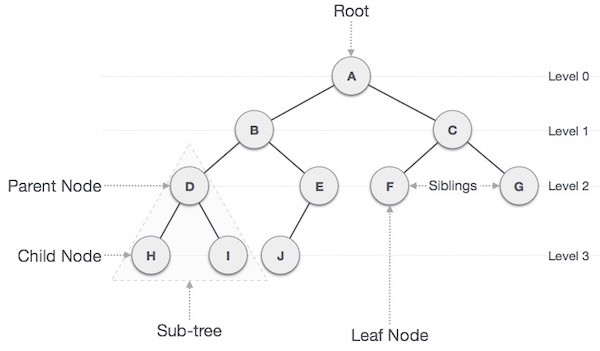

# Composite Design Pattern

## Background

Flutter widgets can become very complicated and difficult to maintain without a specific set of rules and guidelines being followed in their design. The pattern outlined in this document aims to provide these guidelines to ultimately aid in making our Flutter projects more CLEAN.

## Definition

The composite design pattern is structural design pattern described in the famous book by the [Gang Of Four (GOF)](https://en.wikipedia.org/wiki/Design_Patterns). It can be summarised as:

```
Composing objects into tree structures to represent part-whole hierarchies.
```

A part-whole heirarchy:
```
lets clients treat individual objects and compositions of objects uniformly.
```

## Architecture

Your objects are composed into a tree heirarchy as follows:



Where each item in this tree is considered a a generic component which can be a composite (parent) or leaf (child with no children) as follows.


This base component type is what allows us to treat each parent or whole in the hierarchy uniformly.

## Implementation

In practice this means that your widgets should follow the **child pattern**. i.e. always have a child, children or builder property so that they are composable.

Take the following example:

```dart
class Button extends StatelessWidget {
  
  final String label;
  const Button({Key? key, required this.label}) : super(key: key);

  @override
  Widget build(BuildContext context) {
    return Container(
      child: Text('$label'),
    );
  }

}
```
This widget is not following the composite design pattern as it does not have a child arguement and therefore cannot be used to continue composing the hierachy. 

Additionally to this it is very hard to customise the label. What if we wanted to change the color, size, padding etc. We would have to pass a large number of arguments to make these configurations, and it would never be able to handle everything.

A better example following the child pattern would be:

```dart
class Button extends StatelessWidget {
  final Widget label;
  const Button({Key? key, required this.label}) : super(key: key);

  @override
  Widget build(BuildContext context) {
    return Container(
      child: label,
    );
  }
}
```

Now this widget can continue composing the tree heirachy and we can also customise the label however we like.

A few guidelines on well designed widgets are as follows:
- build using the simplist widgets possible (dig into the flutter source code for widgets)
- do one thing and one thing well

## Theory

### Composition

```
the act of combining parts or elements to form a whole.
```

I like to think of composition like lego. Which you build something from smaller parts as follows:


### Inheritance

```
Inheritance is the ability of a class to inherit properties and methods from a superclass (and from the superclass's superclass, and so on).
```

### Composition vs. Inheritance

Composition relationships are has-a relationships as opposed to Inheritance relationships which are often described as is-a relationships.

### Polymorphism

Poly = many.
Morph = change or form.

Therefore polymorphism is 
```
the ability (in programming) to present the same interface for differing underlying forms (data types).
```

This is an excellent [link](https://stackoverflow.com/questions/1031273/what-is-polymorphism-what-is-it-for-and-how-is-it-used) for further reading.

